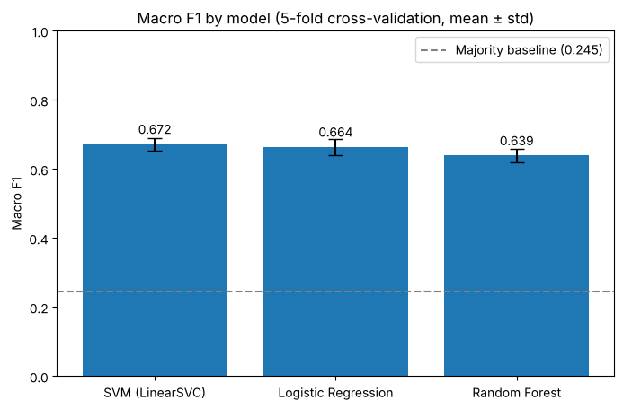
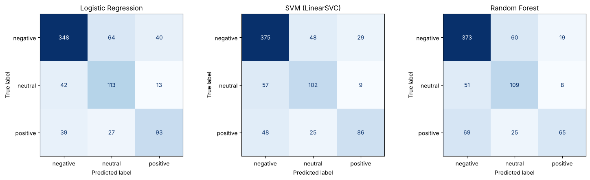

# Flu Vaccine Sentiment Analysis

A data science project that analyzes public sentiment toward influenza (flu) vaccines by combining data from multiple online sources and applying Natural Language Processing (NLP) and Machine Learning techniques.

---

## Overview

Public opinion plays an important role in vaccine acceptance and public health awareness. This project aims to analyze how people perceive flu vaccines by collecting and analyzing data from social media, news articles, and official medical reports.

Using sentiment analysis and machine learning, the project identifies whether public opinions are positive, neutral, or negative, providing valuable insights into vaccine discussions.

---

## Objectives

- Analyze public sentiment toward influenza vaccines.
- Compare opinions from different online sources.
- Perform exploratory data analysis (EDA) to identify trends and patterns.
- Build and compare multiple machine learning models for sentiment classification.
- Select the best-performing model using appropriate evaluation metrics.

---

## Data Sources

The project combines data from multiple publicly available sources:

- YouTube – User comments discussing flu vaccines.
- GNews – News articles related to influenza vaccines.
- OpenFDA – Official adverse event reports submitted to the FDA.

The secondary datasets were collected from Kaggle, including datasets associated with the Zindi Flu Vaccine Challenge, together with publicly available OpenFDA data.

The sentiment models were trained on **3,891 labelled texts**: 3,781 YouTube comments and 110 GNews articles, each labelled negative, neutral or positive. The labels were assigned by the team by hand, with AI assistance, rather than generated by a sentiment tool; VADER was used only during the exploratory analysis of the YouTube data. The OpenFDA reports and the Zindi dataset were used in the exploratory analysis.

---

## Data Preprocessing

The text data was cleaned and prepared using several NLP preprocessing techniques:

- Removing duplicate records
- Handling missing values
- Lowercasing text
- Removing URLs, punctuation, numbers, and special characters
- Removing stop words
- Lemmatization
- Text normalization
- TF-IDF Vectorization

---

## Exploratory Data Analysis

Several analyses were performed to better understand the datasets, including:

- Sentiment distribution
- Word frequency analysis
- Word clouds
- Publication trends over time
- Source comparison
- Vaccine-related discussion patterns

---

## Machine Learning Models

Three supervised classification models were implemented:

- Logistic Regression (Baseline)
- Support Vector Machine (Linear SVM)
- Random Forest

Because the dataset was imbalanced, different balancing techniques were explored:

- Oversampling
- Class weighting (`class_weight="balanced"`)

Oversampling did not improve performance: in cross-validation it scored slightly lower than class weighting for both SVM (Macro F1 0.666 vs 0.672) and Logistic Regression (0.656 vs 0.664). Therefore, class weighting was selected for the final models. The comparison is in `Compare_Models_and_Selection.ipynb`.

All models use the same TF-IDF features (unigrams and bigrams) and are trained and tested on the same stratified 80/20 split, so their scores are directly comparable. Each model is also checked with 5-fold cross-validation.

---

## Evaluation Metrics

The models were evaluated using:

- Accuracy
- Precision
- Recall
- F1-score
- Macro F1-score

Since the dataset is imbalanced, Macro F1-score was selected as the primary evaluation metric because it gives equal importance to all sentiment classes.

---

## Results

| Model | Macro F1 (5-fold CV) | Macro F1 (test set) | Accuracy (test set) |
|--------|:---:|:---:|:---:|
| **Support Vector Machine (SVM)** | **0.672 ± 0.018** | **0.669** | **72.3%** |
| Logistic Regression | 0.664 ± 0.023 | 0.669 | 71.1% |
| Random Forest | 0.639 ± 0.019 | 0.637 | 70.2% |
| *Majority-class baseline* | *0.245* | *0.245* | *58.0%* |



**Key findings**
- **SVM was selected as the final model.** It has the highest average Macro F1 across cross-validation and the highest test accuracy. Logistic Regression is a close second.
- **Accuracy alone would be misleading.** 58% of the texts are negative, so a model that always predicts "negative" already reaches 58% accuracy while never finding a neutral or positive text (Macro F1 0.245).
- **Negative sentiment is the easiest to detect** (F1 ≈ 0.80 for every model). Neutral and positive texts are harder because they share more vocabulary and have fewer examples. Random Forest struggles most with positive texts (F1 0.52).



---

## Technologies Used

- Python
- Pandas
- NumPy
- Scikit-learn
- NLTK
- spaCy
- Matplotlib
- Seaborn
- Google Colab

---

## Project Structure

```
├── Phase 1/   Data collection: YouTube, GNews and OpenFDA API notebooks, raw data, report
├── Phase 2/   Cleaning, exploratory data analysis, TF-IDF vectorization, report
├── Phase 3/   Machine learning
│   ├── Notebooks/
│   │   ├── Baseline_Model.ipynb
│   │   ├── Phase3_SVM_Model.ipynb
│   │   ├── Random_Forest_Model.ipynb
│   │   └── Compare_Models_and_Selection.ipynb   ← final comparison and model selection
│   ├── labeled data files/                      ← data used for training
│   ├── Summary of results/                      ← test-set predictions
│   └── IT362_Project_Report.pdf, project posters
└── docs/      Figures used in this README
```

## How to Run

Open any notebook in Google Colab with the badge at the top, or run it locally:

```bash
git clone https://github.com/talaA2/IT362-DataScienceProject.git
cd IT362-DataScienceProject
pip install pandas numpy scikit-learn matplotlib seaborn jupyter
jupyter notebook "Phase 3/Notebooks/Compare_Models_and_Selection.ipynb"
```

The data collection notebooks in Phase 1 need your own YouTube Data API and GNews API keys.

> **Note:** the PDF reports are the original course submissions. The Phase 3 notebooks were later updated so that every model uses the same data split, so a few numbers may differ slightly from the reports.

---

## Team Members

This project was completed as part of a university Data Science course by a team of five students.

My contributions included:

- Preparing and cleaning datasets
- Building and evaluating the Support Vector Machine (SVM) model
- Experimenting with class balancing techniques
- Creating the project poster
- Contributing to the project report and presentation

---
